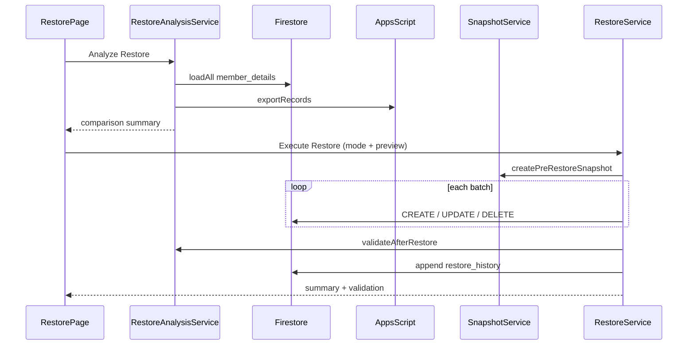

# Restore flow

Manual Google Sheet → Firestore recovery for Super Admins.

## Overview

- **Primary key:** Record ID (Firestore `member_details` document ID)
- **Comparison unit:** Household (head + members + non-members)
- **No automatic reverse sync** — restore is explicit only

## Flow

## Restore modes

| Mode | CREATE | UPDATE | DELETE |
|------|--------|--------|--------|
| Missing Only | Yes | No | No |
| Full | Yes | Yes | Optional orphans |

## Rollback

- Snapshot taken **before** any restore writes
- Rollback re-applies pre-restore Firestore state from `restore_snapshots/{jobId}/households`
- Does **not** revert Google Sheet
- Retention: 30 days (configurable in `RESTORE_CONFIG.SNAPSHOT_RETENTION_DAYS`)

## Apps Script

Deploy updated `Code.gs` with `exportRecords` and `getSpreadsheetId` GET actions before using restore.

## Related

- [Restore schema](./restore-schema.md)
- [Google Apps Script](./google-apps-script.md)
- [Security](./security.md)
